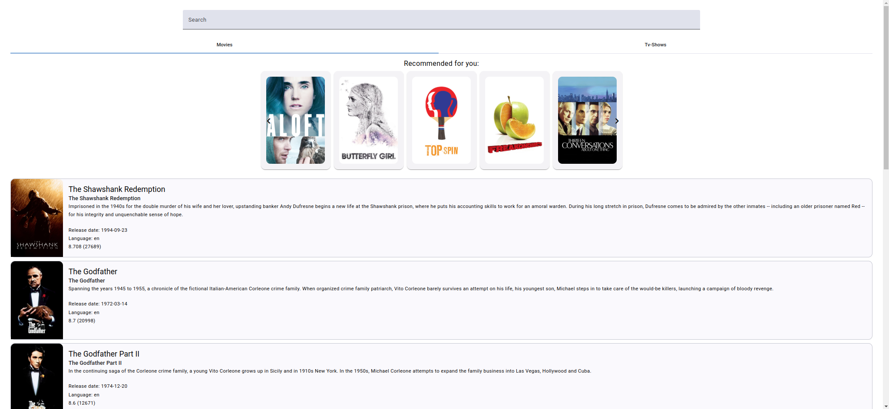

# Movie & TV Shows App

## Description

This application allows users to explore the top 10 rated TV shows and movies. With a simple, user-friendly interface, users can easily browse detailed information on each item and use a powerful search feature to find specific content.
Additionally, the app integrates advanced machine learning model to provide personalized movie recommendations based on the user's previous interactions.

## Overview

The project consists of the following key components:

- **Frontend (User Interface - UI):**
The user interface enables users to browse top-rated movies and TV shows, view detailed information, and get personalized recommendations.

- **TheMovieDB [(TMDB API)](https://developer.themoviedb.org/docs/getting-started):**
A third-party service that provides structured movie and TV show data.

- **Movie Recommendation API:**
A machine learning-based API that analyzes user interactions and generates personalized movie recommendations.

## Features

- **Top 10 TV shows & Movies**: Quickly access lists of the top 10 rated TV shows and top 10 rated movies.
- **Detailed View:** Select any item from the list to open a detailed view, showcasing more details about the selected tv show or movie.
- **Search Functionality** Search feature enables users to find specific tv show or movie with a customizable minimum character limit for triggering results.
- **Configurable Default Tab**: Set the default tab (tv shows or movies) that displays when the application loads, providing a personalized experience.
- **Personalized Recommendations**: The app utilizes a machine learning model to analyze user interactions and provide tailored movie recommendations, enhancing content discovery.
- **Similar Movie Suggestions**: When viewing a movie, the app suggests similar titles based on genre, user preferences, and viewing history, making it easier to explore related content.
- **High UX Design**: Designed with a user-first approach, the app features a clean, modern interface that ensures smooth navigation and interaction.
- **Responsive Design**: The application is fully responsive, offering a seamless experience on desktop, tablet, and mobile devices, adapting to any screen size.

## Screenshot

    

